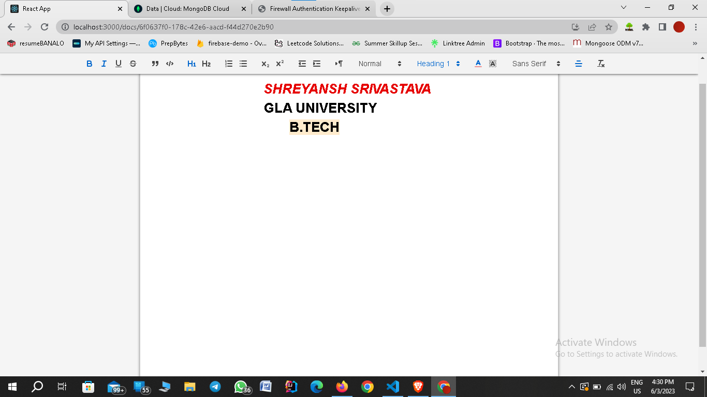

# Google_Doc_Clone
Google Docs is a web-based collaborative document editing and sharing platform developed by Google.It is build using MERN-STACK

💻 Technologies Used :

--> Frontend: React.js & Material-UI

--> Backend: Socket.io

--> Database: MongoDB

  

